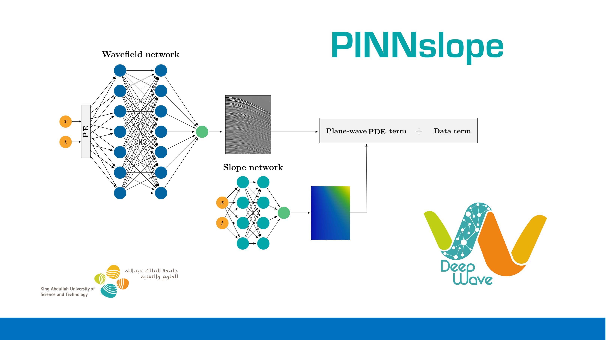

Reproducible material for **PINNslope: seismic data interpolation and local slope estimation with physics informed neural networks - Brandolin F., Ravasi M., Alkhalifah  T.**


## Project structure
This repository is organized as follows:

* :open_file_folder: **pinnslope**: python library containing routines for "PINNslope" seismic data interpolation and local slope estimation with physics informed neural networks;
* :open_file_folder: **data**: folder containing input data and results;
* :open_file_folder: **notebooks**: set of jupyter notebooks reproducing the experiments in the paper (see below for more details);
* :open_file_folder: **asset**: folder containing logo;

## Notebooks
The following notebooks are provided:

- :orange_book: ``PINNslopePE.ipynb`` : notebook performing field seismic data interpolation and local slope estimation.
- :orange_book: ``PINNslope_synth.ipynb`` : notebook performing synthetic seismic data interpolation and local slope estimation
- :orange_book: ``LS_PWreg_Inversion.ipynb`` : notebook performing plane-wave regularized least-squares interpolation.
- :orange_book: ``plottingREALD.ipynb`` : notebook reproducing the figures in the paper (of the field data numerical examples).
- :orange_book: ``plottingSYNTH.ipynb`` : notebook reproducing the figures in the paper (of the synth data numerical examples).  
s
## Getting started
To ensure reproducibility of the results, we suggest using the `environment.yml` file when creating an environment.

Simply run:
```
./install_env.sh
```
It will take some time, if at the end you see the word `Done!` on your terminal you are ready to go. Activate the environment by typing:
```
conda activate envpinnslope
```

After that you can simply install your package:
```
pip install .
```
or in developer mode:
```
pip install -e .
```

**Disclaimer:** All experiments have been carried on a Intel(R) Xeon(R) CPU @ 2.10GHz equipped with a single NVIDIA GEForce RTX 3090 GPU. Different environment 
configurations may be required for different combinations of workstation and GPU.

## Cite Us
s
Brandolin, F., Ravasi, M., & Alkhalifah, T. (2024). Pinnslope: Seismic data interpolation and local slope estimation with physics informed neural networks. GEOPHYSICS , 89 (4), V331-V345. [DOI: 10.1190/geo2023-0323.1](https://doi.org/10.1190/geo2023-0323.1)

Please use the following BibTeX entry to cite this work:

```bibtex
@article{doi:10.1190/geo2023-0323.1,
author = {Francesco Brandolin and Matteo Ravasi and Tariq Alkhalifah},
title = {PINNslope: Seismic data interpolation and local slope estimation with physics informed neural networks},
journal = {GEOPHYSICS},
volume = {89},
number = {4},
pages = {V331-V345},
year = {2024},
doi = {10.1190/geo2023-0323.1},
URL = { https://doi.org/10.1190/geo2023-0323.1},
eprint = {https://doi.org/10.1190/geo2023-0323.1},

}